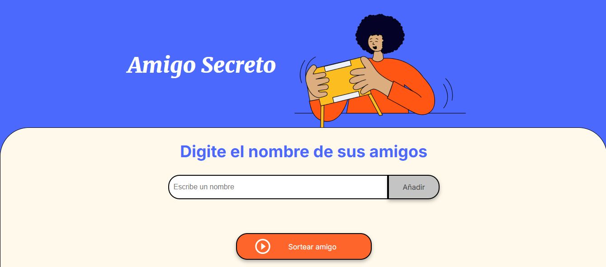

# Amigo Secreto - Sorteo Aleatorio

## Descripción

Este proyecto es una aplicación web interactiva que permite a los usuarios organizar un sorteo de "Amigo Secreto". Los participantes pueden ingresar nombres en una lista, que luego se utilizará para realizar un sorteo aleatorio y determinar quién será el amigo secreto.

## Funcionalidades

- **Agregar nombres**: Los usuarios pueden agregar nombres a la lista utilizando un campo de texto y un botón "Adicionar".
- **Visualización de la lista**: Los nombres ingresados se muestran dinámicamente en una lista visible en la página.
- **Sorteo aleatorio**: Un botón "Sortear Amigo" selecciona un nombre al azar de la lista y muestra el resultado en pantalla.
- **Validaciones**:
  - Evita agregar nombres vacíos.
  - Avisa si se intenta realizar un sorteo sin nombres en la lista.

## Capturas de Pantalla

## Estructura del Proyecto

- **`index.html`**: Contiene la estructura principal de la página web.
- **`styles.css`**: Define los estilos visuales para la aplicación.
- **`script.js`**: Implementa la lógica de la aplicación, incluyendo:
  - Función para agregar nombres.
  - Función para actualizar dinámicamente la lista en pantalla.
  - Función para realizar el sorteo aleatorio.

## Requisitos

- Navegador web moderno (Chrome, Firefox, Edge, etc.).
- No se requieren instalaciones adicionales ni dependencias externas.

## Cómo usar

1. Abre el archivo `index.html` en un navegador.
2. Ingresa los nombres de los amigos en el campo de texto.
3. Haz clic en el botón "Adicionar" para agregar los nombres a la lista.
4. Una vez completada la lista, haz clic en el botón "Sortear Amigo" para realizar el sorteo.
5. El resultado se mostrará en la pantalla.

## Código Principal

El archivo `script.js` contiene las siguientes funciones clave:

- **`agregarAmigo()`**: Agrega un nombre a la lista, asegurándose de que no esté vacío.
- **`actualizarLista()`**: Muestra dinámicamente los nombres ingresados en una lista ordenada.
- **`sortearAmigo()`**: Selecciona un nombre al azar de la lista y lo muestra en pantalla.

## Mejoras Futuras

- Agregar funcionalidad para eliminar nombres de la lista.
- Implementar una opción para reiniciar el sorteo.
- Guardar los nombres en el almacenamiento local del navegador.
- Diseñar una interfaz más atractiva y responsiva.